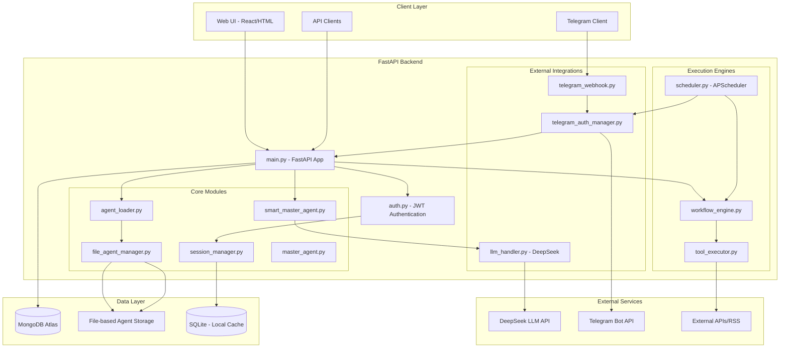
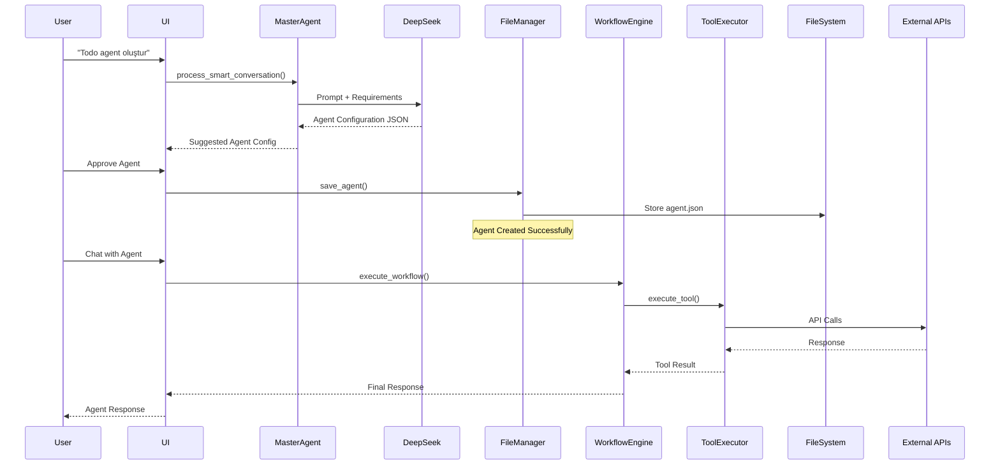
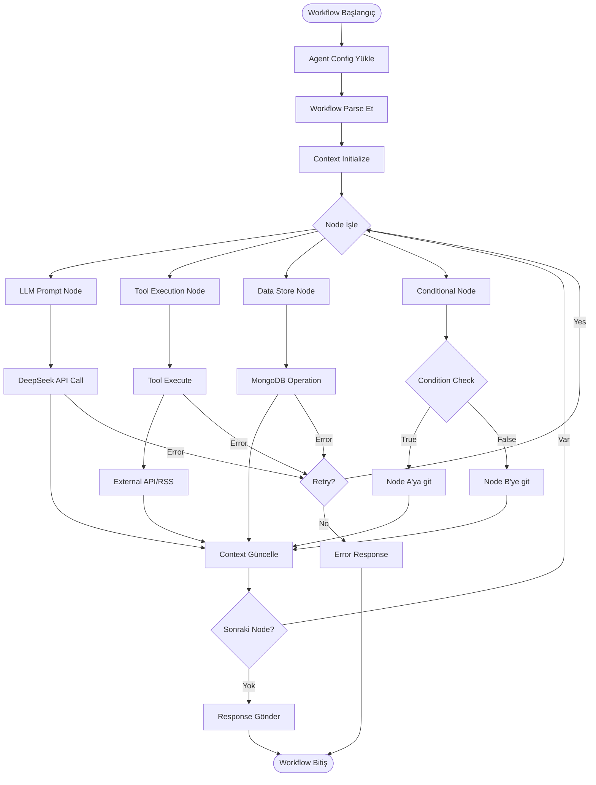
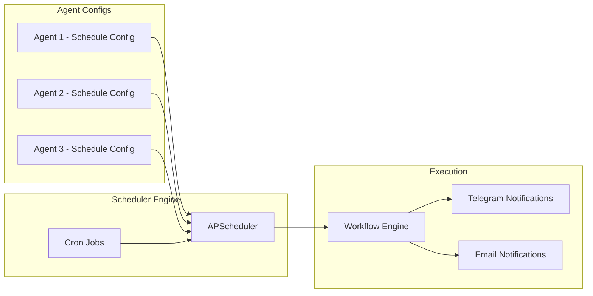
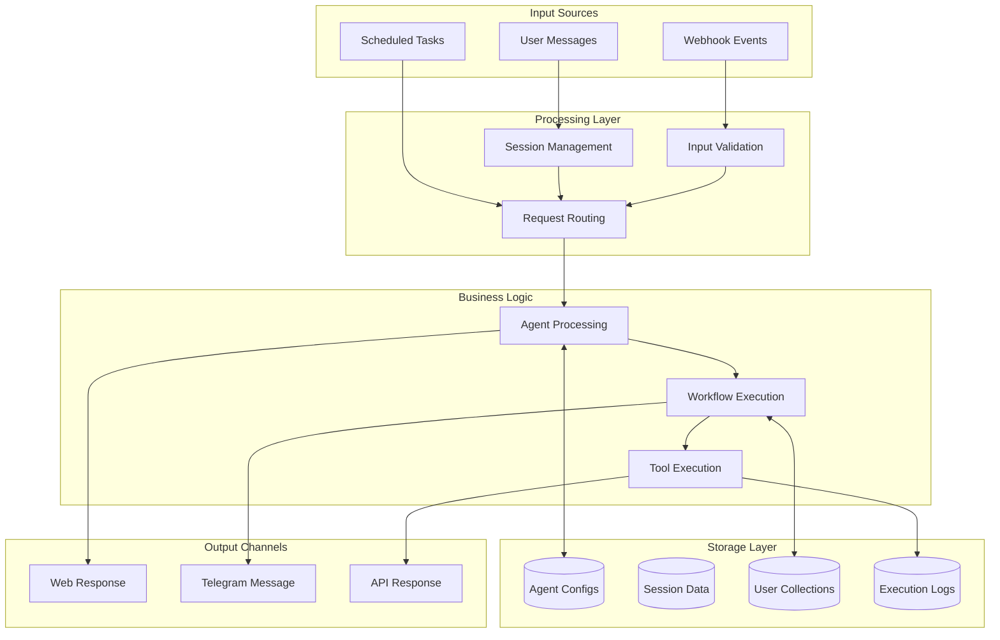
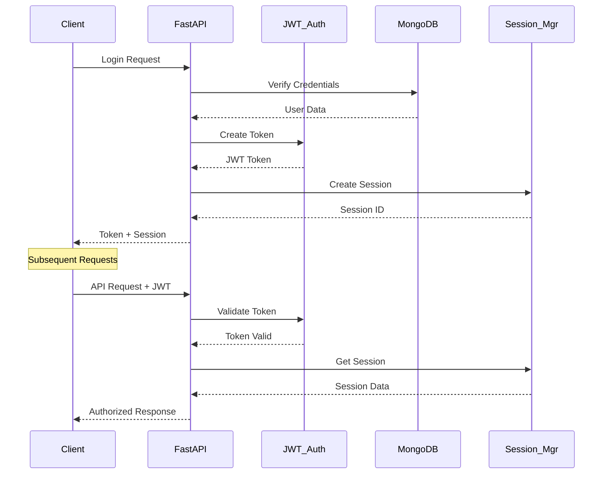

# 🏗️ AI Agent Platform - Detaylı Akış Diyagramı

## Ana Sistem Akışı

## Agent Yaşam Döngüsü Akışı

## Workflow Execution Akışı

## Scheduling System Akışı

## Data Flow Diyagramı

## Security & Authentication Flow

